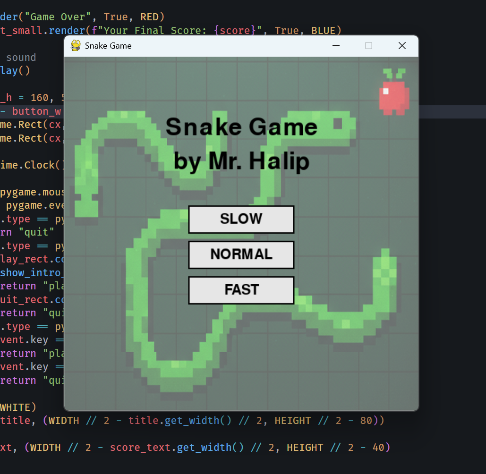

# Snake Game by [Mr. Halip](https://halip26.github.io)

## Description

Snake Game is a classic snake game implemented in Python using the Pygame library. The player controls a snake that grows longer as it eats food, while avoiding collisions with itself and the walls.

## Features

- Playable snake game with adjustable speed levels (slow, normal, fast).
- Sound effects for eating food and game over.
- Attractive graphics with a background image.
- Simple and intuitive controls.

## Requirements

- Python 3.12 or higher
- Pygame library

## Preview



## Installation

1. Clone the repository:

   ```bash
   git clone https://github.com/Halip26/snake-game.git
   cd snake-game
   ```

2. Install the required packages:

   ```bash
   pip install -r requirements.txt
   ```

3. Ensure you have the sound files inside 'assets' directory (`game-point.mp3`, `game-start.mp3`, `game-intro.mp3`, `game-over.mp3`) and the background image (`image-snake-game.png`) in the project directory.

## Usage

Run the game using the following command:

```bash
python snake_game.py
```

## Controls

- Arrow keys to change the direction of the snake.
- Click on the buttons to select the speed level or restart the game after a game over.

## License

This project is licensed under the MIT License. See the [LICENSE](LICENSE) file for details.

## Author

[Mr. Halip](https://halip26.github.io)
